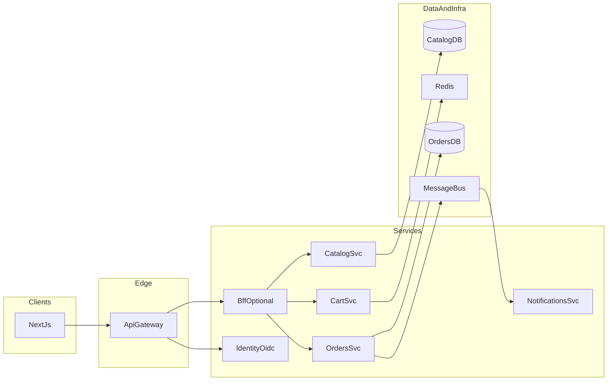

# 13 — Microservis vizyonu ve bounded context’ler

Bu belge, mevcut **modüler monolit** (FastAPI tek deploy, [01-architecture.md](01-architecture.md)) düzeninden hedef **microservis** yapısına giderken üst seviye vizyonu tanımlar. Uygulama yolu **Strangler Fig** (kademeli sarma) ile yapılır; ayrıntılı fazlar için [16-migration-roadmap.md](16-migration-roadmap.md) bkz.

## Hedefler

- Her iş alanı için **ayrı deploy** ve **veri sahipliği** (database per service); servisler arası **doğrudan veritabanı erişimi yok**.
- İstemci ve dış dünya için **tek giriş** (API Gateway); kimlik için **OIDC** uyumlu ayrı kimlik katmanı (bkz. [14-microservices-tech-stack.md](14-microservices-tech-stack.md)).
- Senkron ihtiyaçlar **REST + OpenAPI**; gevşek bağlantı ve yan etkiler **domain event** ile (bkz. [15-microservices-data-and-events.md](15-microservices-data-and-events.md)).
- **Uygulama çatısı**: Bugün **FastAPI + SQLAlchemy + Pydantic**; ön yüz **Next.js + React + Context API** ([14-microservices-tech-stack.md](14-microservices-tech-stack.md)). Hedef microservislerde aynı yığın korunur; servis başına ayrı deploy ve veritabanı uygulanır.

## Uygulama alanından servise eşleme

| Şimdiki sınır (`app/`) | Hedef bounded context / servis | Not |
|------------------------|--------------------------------|-----|
| `routers/catalog` + ilgili repo/servis | **Catalog Service** | Ürün/kategori, arama. |
| `routers/cart` + Redis | **Cart Service** | `X-Cart-Id` veya kullanıcıya bağlı sepet. |
| `routers/orders` | **Orders Service** | Checkout, stok düşümü, durum akışı. |
| `services/notifications` | **Notifications Service** | E-posta; kuyruk + idempotent tüketici. |
| `routers/auth` + JWT | **Identity** (OIDC / harici IdP) | Şimdilik JWT; hedefte OIDC ile değiştirilebilir. |

İsteğe bağlı: **BFF** (Backend for Frontend), Next.js istemcisinin ihtiyaç duyduğu toplu/özgünleştirilmiş API; gateway arkasında durur. İstemci **Next.js** ile gateway veya BFF’e bağlanır ([14-microservices-tech-stack.md](14-microservices-tech-stack.md)).

## Hedef mimari (özet diyagram)

## Strangler Fig prensibi

- Yeni trafik önce **gateway** üzerinden hedef servise yönlendirilir; mevcut monolit API yolları **proxy veya route** ile aşamalı kapatılır.
- Veri migrasyonu **çift yazma / backfill** veya **read replica → kesme** gibi aşamalı stratejilerle; her fazın **Definition of Done**’u [16-migration-roadmap.md](16-migration-roadmap.md) içindedir.

## Senkron ve asenkron sınır

- **Senkron (HTTP)**: kullanıcı yüzünden gelen istek zinciri; gecikme kritik okuma/yazma (ör. checkout anında fiyat doğrulama politikasına bağlı).
- **Asenkron (mesaj)**: bildirim gönderimi, raporlama, denormalize read model güncellemesi; **eventual consistency** kabulü ve UX ile yönetilir.

## Sınır ve sahiplik (Conway)

- Her bounded context için **tek sahip takım** (veya açık “caretaker”) ve **karar mercii** tanımlanır; API ve event şeması değişiklikleri o servisin sorumluluğundadır.
- Çok takım tek repo kullanıyorsa bile **sahiplik README** veya ADR ile sabitlenir (bkz. [adr/README.md](adr/README.md)).

## Dağıtık monolit uyarıları (kırmızı bayraklar)

Aşağıdakiler hedefe aykırıdır; tespit edildiğinde mitigasyon ADR veya bu belgede takip maddesi olarak kayda geçirilir:

- İki veya daha fazla servisin **aynı fiziksel veritabanı şemasına** doğrudan bağlanması.
- Uzun **senkron çağrı zincirleri** (A→B→C→D) kullanıcı isteği boyunca; gecikme ve kırılganlık çoğalır.
- Paylaşılan “ortak iş mantığı” için **hızlı büyüyen iç kütüphane** (version coupling); bkz. paylaşılan kod politikası.

## Paylaşılan kod politikası

- Paylaşılabilir: **stabil** ve ince yapılar — örn. correlation ID taşıma, ortak hata gövdesi şeması, JWT claim isimleri (sadece sabitler).
- Kaçınılır: domain kurallarının kopyalanması yerine **çoğaltılmış** büyük paketler; tercih **açık API + event sözleşmesi**. Ayrıntılı karar için ADR adayı: `0002` (paylaşılan kütüphane sınırları).

## Mevcut katmanlarla ilişki

- [app/services/](../app/services/) ve [app/repositories/](../app/repositories/) ayrıştırılırken iş mantığı ve veri erişimi buradan taşınır.
- [app/schemas/](../app/schemas/) Pydantic modelleri servis sınırlarında **OpenAPI** ile uyumlu kalır; Next.js tarafında isteğe bağlı TypeScript veya codegen kullanılabilir.
- Tek veritabanı içinde modüler monolit iken servisler arası çağrı fonksiyon içindedir; microserviste karşılığı **yalnızca HTTP/event** orkestrasyonudur; başka servisin DB’sine doğrudan erişim yoktur ([15-microservices-data-and-events.md](15-microservices-data-and-events.md)).

## İlgili belgeler

| Belge | Konu |
|-------|------|
| [14-microservices-tech-stack.md](14-microservices-tech-stack.md) | Stack, gateway, dayanıklılık |
| [15-microservices-data-and-events.md](15-microservices-data-and-events.md) | Veri, outbox, event’ler, PII notu |
| [16-migration-roadmap.md](16-migration-roadmap.md) | Fazlar ve DoD |
| [17-deployment-compose-and-k8s.md](17-deployment-compose-and-k8s.md) | Compose ve K8s |
| [18-api-contracts-testing-ops.md](18-api-contracts-testing-ops.md) | Sözleşme, test, SLO |
| [adr/0001-microservices-approach.md](adr/0001-microservices-approach.md) | Mimari karar kaydı |
