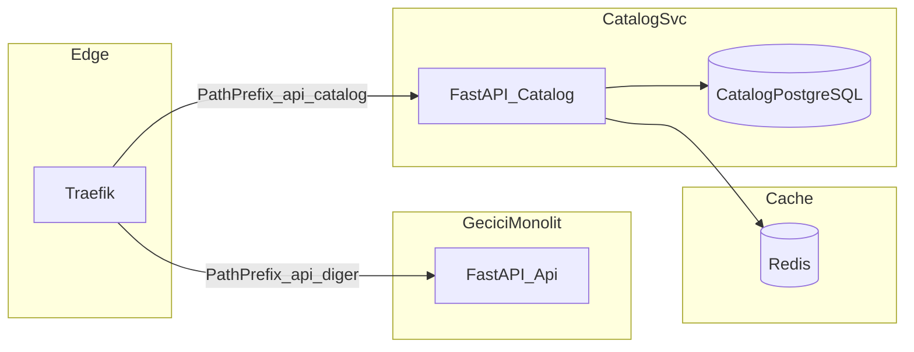

# 21 — Faz 2: Catalog servisi ayrıştırması

Bu belge [19-violation-analysis.md](19-violation-analysis.md) içindeki şu ihlalleri hedefler: **V1** (paylaşılan DB), **V2** (çapraz import — Catalog tarafının monolit içindeki kullanımı), **V3** (paylaşılan model dosyası), **V6** (tek deploy), **V7** (monolitik config), **V12** (paylaşılan Redis — Catalog cache izolasyonu).

Önceki faz: [20-phase0-1-infra-gateway.md](20-phase0-1-infra-gateway.md)  
Sonraki faz: [22-phase3-cart-orders.md](22-phase3-cart-orders.md)

[16-migration-roadmap.md](16-migration-roadmap.md) ile uyumlu: ilk servis ayrıştırması olarak **Catalog** önerilir (çoğunlukla okuma, checkout zincirine doğrudan yazma daha az).

---

## Hedef mimari

- **`services/catalog/`**: yalnızca katalog domain’i — `Category`, `Product`, arama, öne çıkanlar, nav ağacı.
- Monolit (`app/`) içinde **Catalog router’ı** kademeli olarak kapatılır veya proxy ile yeni servise yönlendirilir (Strangler Fig).

---

## 2.1 Veri sahipliği (V1, V3)

**Tercih (önerilen):** Ayrı PostgreSQL **veritabanı** (`catalog_db`) ve ayrı kullanıcı; fiziksel izolasyon.

**Alternatif (geçiş):** Tek PostgreSQL instance, **ayrı şema** (`catalog`) + ayrı DB rolü; kesme sonrası ayrı instance’a taşınır.

Taşınacak ORM modelleri (monolit [app/models.py](../app/models.py)):

- `Category`, `Product` (ve yalnızca bunlara bağlı index/FK’lar).

**Taşınmayan:** `User`, `Order`, `OrderItem` monolitte kalır (Faz 3–4’e kadar).

Alembic: `services/catalog/alembic/` altında bağımsız migrasyon zinciri. Monolit Alembic ile **şema çakışması olmaması** için tablo isimleri veya şema prefix’i netleştirilir.

**Migrasyon stratejisi (özet):**

1. Boş `catalog` DB’de yeni şema oluştur.
2. Monolit DB’den `categories`, `products` (ve bağımlı veri) için **mantıksal export** (pg_dump `-t` veya ETL script).
3. **Read shadow**: kısa süre çift okuma doğrulaması (isteğe bağlı).
4. Traefik trafiği `%100` catalog servisine alındığında monolit tarafındaki catalog tabloları salt-okunur veya kaldırılır (ADR ile).

---

## 2.2 Kod taşıma (V2, V6, V7)

Kaynak referanslar (monolit):

- [app/routers/catalog.py](../app/routers/catalog.py)
- [app/services/catalog_service.py](../app/services/catalog_service.py)
- [app/repositories/catalog_repo.py](../app/repositories/catalog_repo.py)
- [app/schemas/catalog.py](../app/schemas/catalog.py)

**Yeni serviste:**

- FastAPI uygulaması kökü: `services/catalog/app/main.py` (veya eşdeğeri).
- **Yalnızca** catalog’a ait `Settings` alt kümesi: `DATABASE_URL` (catalog DB), Redis URL, cache TTL, `CORS` / internal auth secret’ları.
- Monolit içindeki `catalog_repo` import’ları **kaldırılmadan önce** diğer servisler (Orders, Cart) Faz 3’te HTTP ile catalog’a geçecek şekilde planlanır; Faz 2 sonunda monolit hâlâ aynı DB’ye yazıyorsa **geçici tutarlılık** riski için ADR önerilir (çift yazarlık penceresi).

---

## 2.3 Traefik yönlendirme (V4 ile birlikte)

[20-phase0-1-infra-gateway.md](20-phase0-1-infra-gateway.md) içindeki monolit router **priority=1** kalsın.

**Yeni `catalog` servisi** için örnek label mantığı:

- `traefik.http.routers.catalog.rule=PathPrefix(/api/catalog)`
- `traefik.http.routers.catalog.priority=10` (monolitten yüksek)
- `loadbalancer.server.port=<catalog_container_port>`

Böylece `/api/catalog/*` istekleri doğrudan Catalog mikroservisine gider; `/api/auth`, `/api/cart`, `/api/orders` geçici olarak monolite kalır.

---

## 2.4 Redis izolasyonu (V12)

Catalog nav / arama önbelleği için:

- **Redis DB index** ayrımı (örn. cart `1`, catalog `2`) veya
- Ayrı Redis instance (üretimde tercih edilebilir).

Key prefix monolitteki [app/services/catalog_service.py](../app/services/catalog_service.py) ile uyumlu tutulur veya servis sınırında yeniden adlandırılır (`catalog:nav_tree:v1` gibi).

---

## 2.5 OpenAPI ve sözleşme

- Catalog servisi kendi OpenAPI’sini üretir; `infra/contracts/` altındaki dondurulmuş şema ile **uyum** CI’da kontrol edilir ([20-phase0-1-infra-gateway.md](20-phase0-1-infra-gateway.md), [18-api-contracts-testing-ops.md](18-api-contracts-testing-ops.md)).
- Path ve status kodları mevcut monolit API ile aynı kalmalı (breaking değişiklik yok) veya sürüm yolu (`/v2`) ile ADR.

---

## DoD — Faz 2

- [ ] `services/catalog/` ayrı container/image olarak build edilip çalışıyor.
- [ ] Catalog verisi ayrı DB’de (veya izole şemada); monolit `models.py` içinde Catalog modelleri kaldırıldı veya yalnızca servis içinde.
- [ ] Traefik: `/api/catalog` → catalog servisi; smoke testler yeşil.
- [ ] Redis izolasyonu (index veya instance) dokümante ve yapılandırılmış.
- [ ] Paylaşılan config ayrıştı: catalog `.env` yalnızca catalog ayarlarını içeriyor (V7 kısmi).

---

## Sonraki adım

→ [22-phase3-cart-orders.md](22-phase3-cart-orders.md)

## İlgili belgeler

| Belge | Konu |
|-------|------|
| [15-microservices-data-and-events.md](15-microservices-data-and-events.md) | DB per service, event |
| [14-microservices-tech-stack.md](14-microservices-tech-stack.md) | Stack, gateway |
