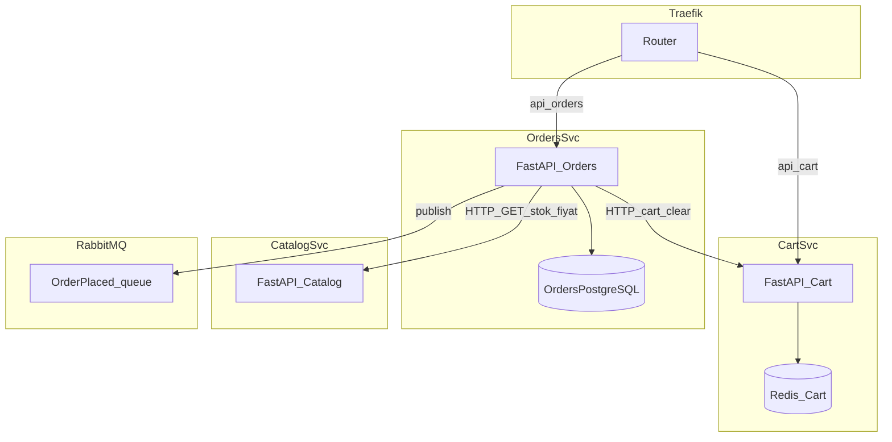

# 22 — Faz 3: Cart ve Orders servisleri + olaylar

Bu belge [19-violation-analysis.md](19-violation-analysis.md) içindeki şu ihlalleri hedefler: **V1**, **V2**, **V5** (senkron checkout zinciri), **V6**, **V7**, **V11** (retry / circuit breaker), **V12** (Cart Redis izolasyonu).

Önceki faz: [21-phase2-catalog-service.md](21-phase2-catalog-service.md)  
Sonraki faz: [23-phase4-identity-notifications.md](23-phase4-identity-notifications.md)

[15-microservices-data-and-events.md](15-microservices-data-and-events.md) ile uyumlu: checkout yan etkileri mümkün olduğunca **event** ve asenkron işlere taşınır.

---

## Hedef mimari



---

## 3.1 Cart servisi (`services/cart/`) — V1, V2, V6, V7, V12

- Durum: **Redis** (`storium:cache:cart:*` veya servis içi prefix) üzerinden sepet JSON.
- Monolit kaynak: [app/services/cart_service.py](../app/services/cart_service.py), [app/routers/cart.py](../app/routers/cart.py).

**V2 çözümü:** Orders veya başka servis sepete **doğrudan import etmez**; yalnızca HTTP:

- `GET /api/cart` (internal header veya service token ile `X-Cart-Id`)
- `DELETE /api/cart` veya `POST /api/cart/clear` (netleştirilmiş sözleşme)

Ürün doğrulama (fiyat, stok) Cart içinde monolit `catalog_repo` kullanılmamalı; **Catalog HTTP API** çağrılır (Faz 2’de ayakta olan servis).

**V12:** Cart Redis’i catalog cache’ten **ayrı DB index veya instance** (Faz 21 ile aynı politika).

---

## 3.2 Orders servisi (`services/orders/`) — V1, V2, V5, V6, V7

- Kendi PostgreSQL veritabanı: `orders`, `order_items` tabloları; **ürün snapshot** (isim, fiyat satır anı) saklanarak Catalog’a uzun vadeli FK bağımlılığı azaltılır (V3 ile uyumlu evrim).
- Monolit kaynak: [app/services/order_service.py](../app/services/order_service.py), [app/repositories/order_repo.py](../app/repositories/order_repo.py), [app/routers/orders.py](../app/routers/orders.py).

**V2 çözümü:**

- Stok düşümü ve ürün okuma: `catalog_repo` yerine **Catalog servisine HTTP** (ör. `POST /internal/v1/products/{id}/reserve` veya idempotent `PATCH` — sözleşme ADR).
- Sepet: `cart_service` import yerine **Cart servisine HTTP**.

**V5 çözümü (senkron zinciri kısaltma):**

- Senkron kalması gereken minimum: ödeme/stok politikasına göre **sipariş kaydı + stok rezervasyonu/düşümü** (aynı kullanıcı isteği içinde).
- **E-posta gönderimi** ve analitik: `OrderPlaced` event’i RabbitMQ’ya (Faz 0 [20-phase0-1-infra-gateway.md](20-phase0-1-infra-gateway.md)); tüketici Faz 4’te [23-phase4-identity-notifications.md](23-phase4-identity-notifications.md).

---

## 3.3 Olay şeması (köprü — Faz 4)

Örnek mesaj (JSON):

```json
{
  "event_type": "OrderPlaced",
  "order_id": 123,
  "user_id": 456,
  "occurred_at": "2026-04-08T12:00:00Z"
}
```

- Üretici: Orders servisi (transaction commit sonrası veya outbox pattern — [15-microservices-data-and-events.md](15-microservices-data-and-events.md)).
- Tüketici: Notifications (Faz 4).

---

## 3.4 Dayanıklılık (V11)

- Tüm çıkış HTTP çağrılarında **timeout** (ör. 2–5 s).
- **Retry**: yalnızca idempotent okumalar ve güvenli GET; stok düşümü ve ödeme için kör retry yok.
- **Circuit breaker**: `httpx` + `tenacity` veya servis mesh / gateway seviyesinde — ekip tercihine göre ADR.
- Hata durumunda **sipariş tutarlılığı**: compensating transaction veya saga taslağı dokümante ([15-microservices-data-and-events.md](15-microservices-data-and-events.md)).

---

## 3.5 Traefik

- `PathPrefix(/api/cart)` → cart servisi, `priority` monolitten yüksek.
- `PathPrefix(/api/orders)` → orders servisi.

---

## DoD — Faz 3

- [ ] Cart ve Orders ayrı image; monolitte ilgili router’lar kapatıldı veya Traefik ile devre dışı.
- [ ] Orders ↔ Catalog ve Orders ↔ Cart iletişimi yalnızca HTTP (V2).
- [ ] Checkout yanıt süresi SMTP’yi beklemez (V5/V10 yönünde); `OrderPlaced` kuyruğa yazılıyor.
- [ ] Timeout + retry politikası yazılı; kritik POST’lar için retry sınırlı veya yok (V11).
- [ ] Uçtan uça test: sepet → checkout → sipariş kaydı → event (mock consumer ile).

---

## Sonraki adım

→ [23-phase4-identity-notifications.md](23-phase4-identity-notifications.md)

## İlgili belgeler

| Belge | Konu |
|-------|------|
| [19-violation-analysis.md](19-violation-analysis.md) | İhlal #5 akışı |
| [18-api-contracts-testing-ops.md](18-api-contracts-testing-ops.md) | Sözleşme testleri |
