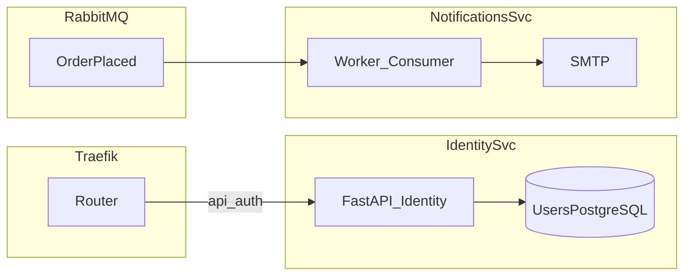

# 23 — Faz 4: Identity ve Notifications

Bu belge [19-violation-analysis.md](19-violation-analysis.md) içindeki şu ihlalleri hedefler: **V1**, **V2**, **V6**, **V7**, **V10** (blocking SMTP ve Identity DB’ye doğrudan erişim).

Önceki faz: [22-phase3-cart-orders.md](22-phase3-cart-orders.md)  
Sonraki faz: [24-phase5-observability.md](24-phase5-observability.md)

[14-microservices-tech-stack.md](14-microservices-tech-stack.md) ile uyumlu: kimlik için OIDC yönü; bildirimler kuyruk tabanlı.

---

## Hedef mimari

---

## 4.1 Identity servisi (`services/identity/`) — V1, V2, V6, V7

- Kendi veritabanı: kullanıcı, parola hash, refresh token store (tasarıma bağlı).
- Monolit kaynak: [app/routers/auth.py](../app/routers/auth.py), [app/security.py](../app/security.py), [app/repositories/user_repo.py](../app/repositories/user_repo.py).

**V2 çözümü:** Notifications veya Orders **user_repo import etmez**; ihtiyaç halinde:

- JWT içinde yeterli claim’ler (ör. `email`, `sub`) veya
- Identity servisinde `GET /internal/users/{id}` (service-to-service auth ile).

**OIDC geçişi (isteğe bağlı evrim):**

- Harici IdP (Keycloak, Azure AD, Auth0): gateway veya Identity BFF üzerinden yetkilendirme kodu akışı.
- Mikroservisler **JWKS** ile imza doğrulama veya **token introspection**; paylaşılan `SECRET_KEY` yerine asimetrik anahtar (ADR).

**Traefik:** `PathPrefix(/api/auth)` identity servisine yönlendirilir; `priority` monolitten yüksek.

---

## 4.2 Notifications servisi (`services/notifications/`) — V10, V2

- **Worker** süreci: RabbitMQ tüketicisi; HTTP API isteğe bağlı yalnızca yönetim/replay için (iç ağ).
- Monolit kaynak: [app/services/notifications.py](../app/services/notifications.py) — `smtplib` senkron çağrı **HTTP isteği yolundan çıkarılır**.

**V10 çözümü:**

- Kuyruktan mesaj alındığında SMTP gönderimi worker’da; başarısızlıkta **retry + dead-letter queue**.
- Büyük hacimde harici e-posta sağlayıcı API’si (SendGrid, SES) ve aynı asenkron model.

**V2 çözümü:** Sipariş e-postası için Orders, kullanıcı e-postasını doğrudan DB’den okumaz; event payload’ında e-posta veya `user_id` + Notifications’ın Identity’ye tek HTTP çağrısı (cache ile).

---

## 4.3 Servisler arası kimlik doğrulama

- Gateway’den iç servislere: **mTLS** veya **signed service JWT** (kısa ömürlü).
- Internal route’lar Traefik’te dışarıya kapalı veya ayrı entrypoint.

---

## DoD — Faz 4

- [ ] `/api/auth` trafiği identity servisinde; kullanıcı verisi ayrı DB’de (V1).
- [ ] Hiçbir servis `user_repo` doğrudan import etmiyor (V2).
- [ ] E-posta gönderimi checkout HTTP isteğini bloklamıyor (V10); kuyruk + worker çalışıyor.
- [ ] Identity ve Notifications için ayrı config / secret yönetimi (V7 kısmi).
- [ ] `OrderPlaced` tüketildiğinde idempotent işleme (aynı `order_id` tekrar gelirse güvenli).

---

## Sonraki adım

→ [24-phase5-observability.md](24-phase5-observability.md)

## İlgili belgeler

| Belge | Konu |
|-------|------|
| [22-phase3-cart-orders.md](22-phase3-cart-orders.md) | OrderPlaced üretimi |
| [adr/0001-microservices-approach.md](adr/0001-microservices-approach.md) | Strangler / kararlar |
